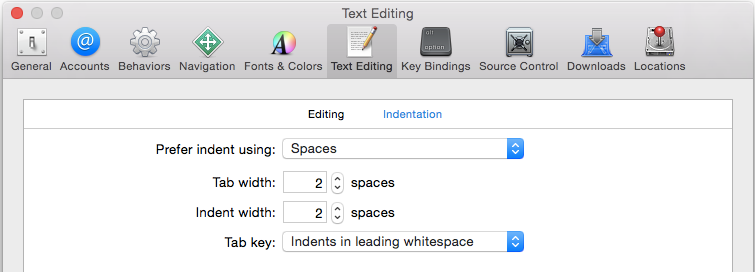

# The Official Belka iOS Dev Guideline.

## Table of Contents

* [Project Structures]()
* [Dependency Management]()
  * [CocoaPods](#cocoapods)
* [Common Libraries]()
* [Deployment]()
  * [Fastlane](#fastlane)
* [Naming](#naming)
  * [Prose](#prose)
  * [Class Prefixes](#class-prefixes)
* [Spacing](#spacing)
* [Comments](#comments)
* [Classes and Structures](#classes-and-structures)
  * [Use of Self](#use-of-self)
  * [Protocol Conformance](#protocol-conformance)
  * [Computed Properties](#computed-properties)
* [Function Declarations](#function-declarations)
* [Closure Expressions](#closure-expressions)
* [Types](#types)
  * [Constants](#constants)
  * [Optionals](#optionals)
  * [Struct Initializers](#struct-initializers)
  * [Type Inference](#type-inference)
  * [Syntactic Sugar](#syntactic-sugar)
* [Control Flow](#control-flow)
* [Semicolons](#semicolons)
* [Language](#language)
* [Copyright Statement](#copyright-statement)
* [Smiley Face](#smiley-face)
* [Credits](#credits)

## Project Structures
You should structure any new iOS project as follow:

```	
 .
 ├── AppDelegate.swift
 ├── Constants	
 ├── Controllers (or ViewModels, if your architecture is MVVM)
 ├── Extensions
 ├── Helpers
 ├── Models
 ├── Resources
 ├── Stores
 ├── Views
```


## Dependency Management

### CocoaPods
If you're planning on including external dependencies (e.g. third-party libraries) in your project, [CocoaPods](https://cocoapods.org) offers easy and fast integration. Install it like so:

```bash
sudo gem install cocoapods
```

To get started, move inside your iOS project folder and run

```bash
pod init
```

This creates a Podfile, which will hold all your dependencies in one place. After adding your dependencies to the Podfile, you run
```bash
pod install
```

to install the libraries and include them as part of a workspace which also holds your own project. It is generally [recommended to commit the installed dependencies to your own repo][committing-pods], instead of relying on having each developer running `pod install` after a fresh checkout.

Note that from now on, you'll need to open the `.xcworkspace` file instead of `.xcproject`, or your code will not compile. The command

```bash
pod update
```

will update all pods to the newest versions permitted by the Podfile. You can use a wealth of [operators][cocoapods-pod-syntax] to specify your exact version requirements.

[cocoapods]: https://cocoapods.org/
[cocoapods-pod-syntax]: http://guides.cocoapods.org/syntax/podfile.html#pod
[committing-pods]: https://www.dzombak.com/blog/2014/03/including-pods-in-source-control.html

## Common Libraries
The libraries featured here tend to reduce boilerplate code (e.g. Auto Layout) or solve complex problems that require extensive testing, such as date calculations. As you become more proficient with iOS, be sure to dive into the source here and there, and acquaint yourself with their underlying Apple frameworks. You'll find that those alone can do a lot of the heavy lifting.

### Alamofire
Alamofire is an HTTP networking library written in Swift.

### Moya
So the basic idea of Moya is that we want some network abstraction layer that sufficiently encapsulates actually calling Alamofire directly. It should be simple enough that common things are easy, but comprehensive enough that complicated things are also easy.

### HanekeSwift
Haneke is a lightweight generic cache for iOS and tvOS written in Swift 2.0. It's designed to be super-simple to use.

### SwiftyJSON
The better way to deal with JSON data in Swift

### ObjectMapper
ObjectMapper is a framework written in Swift that makes it easy for you to convert your model objects (classes and structs) to and from JSON.

### XCGLogger
A debug log framework for use in Swift projects. Allows you to log details to the console (and optionally a file), just like you would have with NSLog or println, but with additional information, such as the date, function name, filename and line number.


## Deployment

### fastlane
fastlane lets you define and run your deployment pipelines for different environments. It helps you unify your app’s release process and automate the whole process. fastlane connects all fastlane tools and third party tools, like CocoaPods and Gradle.

Each application should be have their fastlane in order to make the App deployment as simple as possibile.

To get started, move in your iOS project folder and run 

```bash
fastlane init
``` 

after that follow the setup assistant which will set up fastlane for you. 
You can customize all the fastlane Action editing the `Fastlane` file.

#### Basic configuration
The `Fastfile` must include the following basic actions:
- Deploy on App Store
- Deploy on TestFlight

**Example of beta deployment**

```ruby
lane :beta do
  increment_build_number
  cocoapods
  testflight

  slack
end
```

## Naming

Use descriptive names with camel case for classes, methods, variables, etc. Class names should be capitalized, while method names and variables should start with a lower case letter.

Use `k` prefix when you declare a class constant or a global one.

**Preferred:**

```swift
private let kMaximumWidgetCount = 100

class WidgetContainer {
  var widgetButton: UIButton
  let widgetHeightPercentage = 0.85
}
```

**Not Preferred:**

```swift
let MAX_WIDGET_COUNT = 100

class app_widgetContainer {
  var wBut: UIButton
  let wHeightPct = 0.85
}
```

For functions and init methods, prefer named parameters for all arguments unless the context is very clear. Include external parameter names if it makes function calls more readable.

```swift
func dateFromString(dateString: String) -> NSDate
func convertPointAt(#column: Int, #row: Int) -> CGPoint
func timedAction(#delay: NSTimeInterval, perform action: SKAction) -> SKAction!

// would be called like this:
dateFromString("2014-03-14")
convertPointAt(column: 42, row: 13)
timedAction(delay: 1.0, perform: someOtherAction)
```

For methods, follow the standard Apple convention of referring to the first parameter in the method name:

```swift
class Guideline {
  func combineWithString(incoming: String, options: Dictionary?) { ... }
  func upvoteBy(amount: Int) { ... }
}
```

### Enumerations

Use PascalCase for enumeration values:

```swift
enum Shape {
  case Rectangle
  case Square
  case Triangle
  case Circle
}
```

### Class Prefixes

Swift types are automatically namespaced by the module that contains them and you should not add a class prefix. If two names from different modules collide you can disambiguate by prefixing the type name with the module name.

```swift
import SomeModule

let myClass = MyModule.UsefulClass()
```


## Spacing

* Indent using 2 spaces rather than tabs to conserve space and help prevent line wrapping. Be sure to set this preference in Xcode as shown below:

  

* Method braces and other braces (`if`/`else`/`switch`/`while` etc.) always open on the same line as the statement but close on a new line.
* Tip: You can re-indent by selecting some code (or ⌘A to select all) and then Control-I (or Editor\Structure\Re-Indent in the menu). Some of the Xcode template code will have 4-space tabs hard coded, so this is a good way to fix that.

**Preferred:**
```swift
if user.isHappy {
  // Do something
} else {
  // Do something else
}
```

**Not Preferred:**
```swift
if user.isHappy
{
    // Do something
}
else {
    // Do something else
}
```

* There should be exactly one blank line between methods to aid in visual clarity and organization. Whitespace within methods should separate functionality, but having too many sections in a method often means you should refactor into several methods.

**Example:**

```swift
func convertPointAt(column column: Int, row: Int) -> CGPoint {
	//First functionality
	let center = CGPoint()
	
	//Second functionality...
}

func saveUserData(userUser userUser: User) { ... }

```

## Comments

When they are needed, use comments to explain **why** a particular piece of code does something. Comments must be kept up-to-date or deleted.

Avoid block comments inline with code, as the code should be as self-documenting as possible. *Exception: This does not apply to those comments used to generate documentation.*

### Special code Marker

#### Mark
Use this tag to mark code with same function
**Example**

```swift
//MARK: - Factory methods

//MARK: - Networking methods

```

#### TODO and FIXME
Use this tags only when you are developing new features.
 
**Important**: Don't leave them into a pull request otherwise the request **will be rejected**.

### Documentation
It's mandatory to write Xcode Headerdoc comments above public class function. The syntax to write this type of comment is Apple Headerdoc.

**important** if you miss this type of comment Xcode will give you a warning.

**Example:**

```swift 
/**
Lorem ipsum dolor sit amet.

   @param bar Consectetur adipisicing elit.

   @return Sed do eiusmod tempor.
*/
func foo(bar bar: String) -> AnyObject { ... }
```

## Classes and Structures

### Which one to use?

Remember, structs have [value semantics](https://developer.apple.com/library/mac/documentation/Swift/Conceptual/Swift_Programming_Language/ClassesAndStructures.html#//apple_ref/doc/uid/TP40014097-CH13-XID_144). Use structs for things that do not have an identity. An array that contains [a, b, c] is really the same as another array that contains [a, b, c] and they are completely interchangeable. It doesn't matter whether you use the first array or the second, because they represent the exact same thing. That's why arrays are structs.

Classes have [reference semantics](https://developer.apple.com/library/mac/documentation/Swift/Conceptual/Swift_Programming_Language/ClassesAndStructures.html#//apple_ref/doc/uid/TP40014097-CH13-XID_145). Use classes for things that do have an identity or a specific life cycle. You would model a person as a class because two person objects are two different things. Just because two people have the same name and birthdate, doesn't mean they are the same person. But the person's birthdate would be a struct because a date of 3 March 1950 is the same as any other date object for 3 March 1950. The date itself doesn't have an identity.

Sometimes, things should be structs but need to conform to `AnyObject` or are historically modeled as classes already (`NSDate`, `NSSet`). Try to follow these guidelines as closely as possible.

#### When should I use a Struct ?
As a general guideline, consider creating a structure when one or more of these conditions apply:

- The structure’s primary purpose is to encapsulate a few relatively simple data values.
- It is reasonable to expect that the encapsulated values will be copied rather than referenced when you assign or pass around an instance of that structure.
- Any properties stored by the structure are themselves value types, which would also be expected to be copied rather than referenced.
- **The structure does not need to inherit properties or behavior from another existing type.**

Examples of good candidates for structures include:

- The size of a geometric shape, perhaps encapsulating a width property and a height property, both of type Double.
- A way to refer to ranges within a series, perhaps encapsulating a start property and a length property, both of type Int.
- A point in a 3D coordinate system, perhaps encapsulating x, y and z properties, each of type Double.


### Example definition

Here's an example of a well-styled class definition:

```swift
class Circle: Shape {
  var x: Int, y: Int
  var radius: Double
  var diameter: Double {
    get {
      return radius * 2
    }
    set {
      radius = newValue / 2
    }
  }

  init(x: Int, y: Int, radius: Double) {
    self.x = x
    self.y = y
    self.radius = radius
  }

  convenience init(x: Int, y: Int, diameter: Double) {
    self.init(x: x, y: y, radius: diameter / 2)
  }

  func describe() -> String {
    return "I am a circle at \(centerString()) with an area of \(computeArea())"
  }
  
  func debugDescribe() -> String {
  	  return "x:\(x), y:\(y)"
  }

  override func computeArea() -> Double {
    return M_PI * radius * radius
  }

  private func centerString() -> String {
    return "(\(x),\(y))"
  }
}
```

The example above demonstrates the following style guidelines:

 + Specify types for properties, variables, constants, argument declarations and other statements with a space after the colon but not before, e.g. `x: Int`, and `Circle: Shape`.
 + Define multiple variables and structures on a single line if they share a common purpose / context.
 + Indent getter and setter definitions and property observers.
 + Don't add modifiers such as `internal` when they're already the default. Similarly, don't repeat the access modifier when overriding a method.
 + **It's mandatory to implement the debugDescription methods in the Model Classes**


### Use of Self

For conciseness, avoid using `self` since Swift does not require it to access an object's properties or invoke its methods.

Use `self` when required to differentiate between property names and arguments in initializers, and when referencing properties in closure expressions (as required by the compiler):

```swift
class BoardLocation {
  let row: Int, column: Int

  init(row: Int, column: Int) {
    self.row = row
    self.column = column
    
    let closure = {
      println(self.row)
    }
  }
}
```

### Protocol Conformance

When adding protocol conformance to a class, prefer adding a separate class extension for the protocol methods. This keeps the related methods grouped together with the protocol and can simplify instructions to add a protocol to a class with its associated methods.

Also, don't forget the `// MARK: -` comment to keep things well-organized!

**Preferred:**
```swift
class MyViewcontroller: UIViewController {
  // class stuff here
}

// MARK: - UITableViewDataSource
extension MyViewcontroller: UITableViewDataSource {
  // table view data source methods
}

// MARK: - UIScrollViewDelegate
extension MyViewcontroller: UIScrollViewDelegate {
  // scroll view delegate methods
}
```

### Use of Protocols to keep a good code redability
At this [link](https://www.natashatherobot.com/using-swift-extensions/?utm_campaign=iOS%2BDev%2BWeekly&utm_medium=web&utm_source=iOS_Dev_Weekly_Issue_244) you can find a very good explanation on how to use Protocols and Extensions to maintain a good code redability.


**Not Preferred:**
```swift
class MyViewcontroller: UIViewController, UITableViewDataSource, UIScrollViewDelegate {
  // all methods
}
```

### Computed Properties

For conciseness, if a computed property is read-only, omit the get clause. The get clause is required only when a set clause is provided.

**Preferred:**
```swift
var diameter: Double {
  return radius * 2
}
```

**Not Preferred:**
```swift
var diameter: Double {
  get {
    return radius * 2
  }
}
```

## Function Declarations

Keep short function declarations on one line including the opening brace:

```swift
func reticulateSplines(spline: [Double]) -> Bool {
  // reticulate code goes here
}
```

For functions with long signatures, add line breaks at appropriate points and add an extra indent on subsequent lines:

```swift
func reticulateSplines(spline: [Double], adjustmentFactor: Double,
    translateConstant: Int, comment: String) -> Bool {
  // reticulate code goes here
}
```


## Closure Expressions

Use trailing closure syntax only if there's a single closure expression parameter at the end of the argument list. Give the closure parameters descriptive names.

**Preferred:**
```swift
UIView.animateWithDuration(1.0) {
  self.myView.alpha = 0
}

UIView.animateWithDuration(1.0,
  animations: {
    self.myView.alpha = 0
  },
  completion: { finished in
    self.myView.removeFromSuperview()
  }
)
```

**Not Preferred:**
```swift
UIView.animateWithDuration(1.0, animations: {
  self.myView.alpha = 0
})

UIView.animateWithDuration(1.0,
  animations: {
    self.myView.alpha = 0
  }) { f in
    self.myView.removeFromSuperview()
}
```

For single-expression closures where the context is clear, use implicit returns:

```swift
attendeeList.sort { a, b in
  a > b
}
```


## Types

Always use Swift's native types when available. Swift offers bridging to Objective-C so you can still use the full set of methods as needed.

**Preferred:**
```swift
let width = 120.0                                    // Double
let widthString = (width as NSNumber).stringValue    // String
```

**Not Preferred:**
```swift
let width: NSNumber = 120.0                          // NSNumber
let widthString: NSString = width.stringValue        // NSString
```

In Sprite Kit code, use `CGFloat` if it makes the code more succinct by avoiding too many conversions.

### Constants

Constants are defined using the `let` keyword, and variables with the `var` keyword. Always use `let` instead of `var` if the value of the variable will not change.

**Tip:** A good technique is to define everything using `let` and only change it to `var` if the compiler complains!


### Optionals

Declare variables and function return types as optional with `?` where a nil value is acceptable.

Use implicitly unwrapped types declared with `!` only for instance variables that you know will be initialized later before use, such as subviews that will be set up in `viewDidLoad`.

When accessing an optional value, use optional chaining if the value is only accessed once or if there are many optionals in the chain:

```swift
self.textContainer?.textLabel?.setNeedsDisplay()
```

Use optional binding when it's more convenient to unwrap once and perform multiple operations:

```swift
if let textContainer = self.textContainer {
  // do many things with textContainer
}
```

When naming optional variables and properties, avoid naming them like `optionalString` or `maybeView` since their optional-ness is already in the type declaration.

For optional binding, shadow the original name when appropriate rather than using names like `unwrappedView` or `actualLabel`.

**Preferred:**
```swift
var subview: UIView?
var volume: Double?

// later on...
if let subview = subview, volume = volume {
  // do something with unwrapped subview and volume
}
```

**Not Preferred:**
```swift
var optionalSubview: UIView?
var volume: Double?

if let unwrappedSubview = optionalSubview {
  if let realVolume = volume {
    // do something with unwrappedSubview and realVolume
  }
}
```

### Struct Initializers

Use the native Swift struct initializers rather than the legacy CGGeometry constructors.

**Preferred:**
```swift
let bounds = CGRect(x: 40, y: 20, width: 120, height: 80)
let centerPoint = CGPoint(x: 96, y: 42)
```

**Not Preferred:**
```swift
let bounds = CGRectMake(40, 20, 120, 80)
let centerPoint = CGPointMake(96, 42)
```

Prefer the struct-scope constants `CGRect.infiniteRect`, `CGRect.nullRect`, etc. over global constants `CGRectInfinite`, `CGRectNull`, etc. For existing variables, you can use the shorter `.zeroRect`.

### Type Inference

Prefer compact code and let the compiler infer the type for a constant or variable, unless you need a specific type other than the default such as `CGFloat` or `Int16`.

**Preferred:**
```swift
let message = "Click the button"
let currentBounds = computeViewBounds()
var names = [String]()
let maximumWidth: CGFloat = 106.5
```

**Not Preferred:**
```swift
let message: String = "Click the button"
let currentBounds: CGRect = computeViewBounds()
var names: [String] = []
```

**NOTE**: Following this guideline means picking descriptive names is even more important than before.


### Syntactic Sugar

Prefer the shortcut versions of type declarations over the full generics syntax.

**Preferred:**
```swift
var deviceModels: [String]
var employees: [Int: String]
var faxNumber: Int?
```

**Not Preferred:**
```swift
var deviceModels: Array<String>
var employees: Dictionary<Int, String>
var faxNumber: Optional<Int>
```


## Control Flow

Prefer the `for-in` style of `for` loop over the `for-condition-increment` style.

**Preferred:**
```swift
for _ in 0..<3 {
  println("Hello three times")
}

for (index, person) in enumerate(attendeeList) {
  println("\(person) is at position #\(index)")
}
```

**Not Preferred:**
```swift
for var i = 0; i < 3; i++ {
  println("Hello three times")
}

for var i = 0; i < attendeeList.count; i++ {
  let person = attendeeList[i]
  println("\(person) is at position #\(i)")
}
```


## Semicolons

Swift does not require a semicolon after each statement in your code. They are only required if you wish to combine multiple statements on a single line.

Do not write multiple statements on a single line separated with semicolons.

The only exception to this rule is the `for-conditional-increment` construct, which requires semicolons. However, alternative `for-in` constructs should be used where possible.

**Preferred:**
```swift
let swift = "not a scripting language"
```

**Not Preferred:**
```swift
let swift = "not a scripting language";
```

**NOTE**: Swift is very different to JavaScript, where omitting semicolons is [generally considered unsafe](http://stackoverflow.com/questions/444080/do-you-recommend-using-semicolons-after-every-statement-in-javascript)

## Language

Use US English spelling to match Apple's API.

**Preferred:**
```swift
let color = "red"
```

**Not Preferred:**
```swift
let colour = "red"
```

## License
Android-Toggle-Switch is Copyright (c) 2016 Belka, srl. It is free software, and may be redistributed under the terms specified in the LICENSE file.  


## Credits

We drew inspiration from other Code Guidelines and online materials:

* [raywenderlich.com](http://raywenderlich.com)
* [futurice](https://github.com/futurice/ios-good-practices)
* [The Swift Programming Language](https://developer.apple.com/library/prerelease/ios/documentation/swift/conceptual/swift_programming_language/index.html)
* [Using Swift with Cocoa and Objective-C](https://developer.apple.com/library/prerelease/ios/documentation/Swift/Conceptual/BuildingCocoaApps/index.html)
* [Swift Standard Library Reference](https://developer.apple.com/library/prerelease/ios/documentation/General/Reference/SwiftStandardLibraryReference/index.html)

## About Belka


[Belka](http://belka.us/en) is a Digital Agency specialized in design, mobile applications development and custom solutions.
We love open source software! You can [see our projects](http://belka.us/en/portfolio/) or look at our case studies.

Interested? [Hire us](http://belka.us/en/contacts/) to help build your next amazing project.

[www.belka.us](http://belka.us/en)
